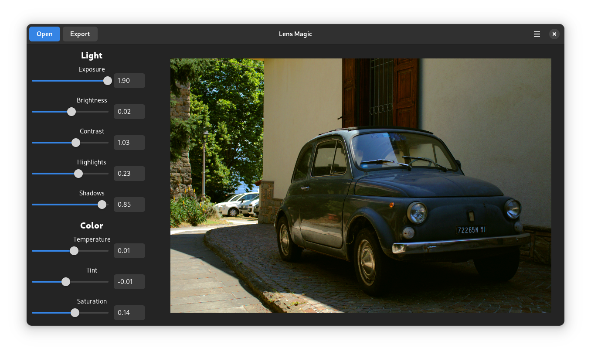

# Lens Magic
Fast and easy to use app for photo development and quick tweaks that supports RAW files.

*Application is in early development. Main branch should be kept in working state.*

Testing and feedback is very appreciated!

This project aims to fill in the gap on Linux for easy to use app for RAW development and 
image tweaking. Goal of this app is to be easy as possible, follow GNOME style and be fast.
This should be achieved by using libadwaita for UI and OpenGL for the rendering.

## Current stage
- It is possible to open normal and RAW image
    - Uses libraw library - currently only loads image processed by the library itself with 
    maximum quality, camera WB and no auto brightness
    - Normal images are opened by creating gdk_pixbuf (for now)
- Modify lightness and color of the picture
    - Some features are not fully completed yet
- Export full resolution image
- Modifications are previewed on 4x smaller image than original for speed reasons
- Uses OpenGL for all rendering
    - This makes it more compatible than OpenCL and Cuda and faster than software rendering

## Next steps
There is a lot of planned features, so these are just the ones that are planned in the near future.
- Configurable preview size (do not force lower res and allow customization)
- More options to adjust images
- Streamline loading, stop relying on gtk for picture load
- More export options and formats
- Do RAW image processing instead of relying on libraw
